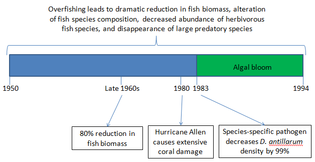

##Hughes, T. P. (1994). Catastrophes, Phase Shifts and Large-Scale Degradation of a Caribbean Coral Reef. Science. 265 (5178), 1547-1551.

##Scheffer, M., Carpenter, S. R., et al. (2012). Anticipating Critical Transitions. Science, 338 (6105), 344–348. 

__Summary:__
As the magnitude of the effects of critical transitions in complex systems becomes apparent, scientists have attempted to identify the features of fragile systems. Scheffer et al. summarize findings from the seemingly disparate fields of economics, climate science, ecology, and others. They present architectural features of systems susceptible to critical transition and also warning signs that a tipping point is imminent. Systems with high connectivity and homogeneity, while able to quickly recover from minor perturbation, are prone to cascading state changes in connected nodes, which leads to rapid change in overall system state once some critical threshold of environmental change is reached. Two main indicateindicators that a system is approaching a critical transition are 1) slowing of recovery from perturbations, and 2), in stochastic systems, “flickering” of the system’s state between the current state and a new state, with a resultant increase in variance.

As stated by Scheffer et al., repeated recovery from small-scale perturbations can falsely suggest systemic resilience, concealing a possible approach toward a phase shift (2012). One such example is the decline of Caribbean coral cover in the 1980s, described in detail by Hughes (1994). Like many ecological systems, the Caribbean coral reef community is a complex network of species (nodes) and species interactions (connections) that are affected by myriad environmental factors, both natural (e.g. hurricanes) and anthropogenic (e.g. fishing). Corals were first significantly damaged by a category 5 hurricane in 1980. Overharvesting of herbivorous fish species and the vast reduction in herbivorous sea urchin (Diadema antillarum) resulted in a long-term algal bloom. This algal bloom began in 1983, interrupting the coral’s recovery from hurricane damage and reducing coral cover from 52%  to 3% in just over a decade.

__Pre-discussion Questions:__

1. What is the tradeoff between local and systemic resilience? What are the implications of this tradeoff?

2. Do you think that changes in management, such as restrictions on fishing, would be capable of restoring the Jamaican reef to its prior state? Why or why not?

3. Does the Caribbean reef system show strong or weak connectivity between nodes? How does this affect the system’s behavior?

4. Scheffer et al identify two potential indicators of when systems are nearing critical transitions: slowing and flickering. Could a system nearing a critical transition exhibit both slowing and flickering? Why or why not?

5. What potential does the framework presented by Scheffer et al. currently have for predicting the behavior of complex systems? What additional information, if any, would be required to make useful predictions?

